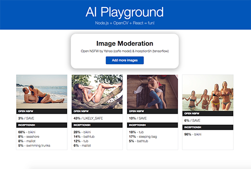

# AI Playground

This is an experimental setup of node.js, opencv and react, with the purpose to automaticly moderate user-generated images.
It comes with a simple API that implements Yahoo`s Open NSFW model (caffe) and Inception5h (tensorflow) to score and classify images.
A big thank you goes to justadudewhohacks, who brought up opencv4nodejs with all the node.js bindings for opencv!

### Installing

Installation is done just by yarn.
If you dont use yarn yet, go get it, because it makes the install process great again :)
Please note that this project depends on opencv >= 3.4.1. and you might need to use the fix below to get everything to work.

```
run yarn

Temp fix to install opencv 3.4.1 with NPM:
change the opencv version in line 14 in node_modules/opencv-build/install/setup-opencv.js to 3.4.1
node node_modules/opencv-build/install
yarn add opencv4nodejs
```

### Run

```
Debug:   yarn start
Build:   yarn build
Release: yarn build --release
Test:    yarn test
Stats:   yarn build-stats
```

### Example



## License

This project is licensed under the MIT License